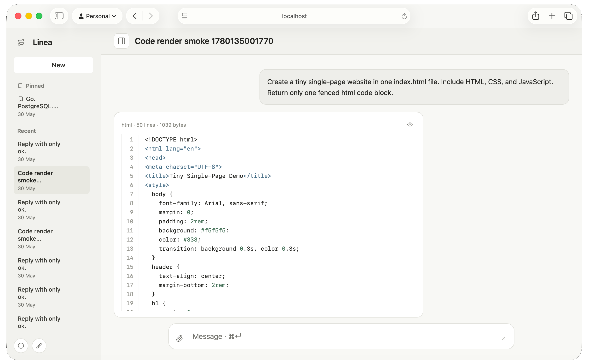

# Linea

<picture>
  <source media="(prefers-color-scheme: dark)" srcset="./assets/linea-route.svg">
  <source media="(prefers-color-scheme: light)" srcset="./assets/linea-route-dark.svg">
  
</picture>

Local AI chat.

Public notes: [bniladridas.github.io/linea](https://bniladridas.github.io/linea/).

Runs as one Go server with a React UI.

Stores conversations in PostgreSQL when `DATABASE_URL` is set.

Uses memory storage when `DATABASE_URL` is empty.

# Run

Run `linea`.

Open `http://127.0.0.1:8080`.

Run `linea -check` to check setup.

Run `make install-check` to check the Homebrew formula.

Run `make release-check` after a release.

# Models

Gemini is primary.

Gemini handles image input.

Cerebras and SambaNova use OpenAI-compatible endpoints.

Ollama can run locally.

Put keys in `~/.config/linea/linea.env` or shell variables.

# More

Setup and checks: [docs/reference.md](./docs/reference.md).

Client API: [docs/client-api.md](./docs/client-api.md).

macOS app: [docs/macos.md](./docs/macos.md).

# License

MIT.
