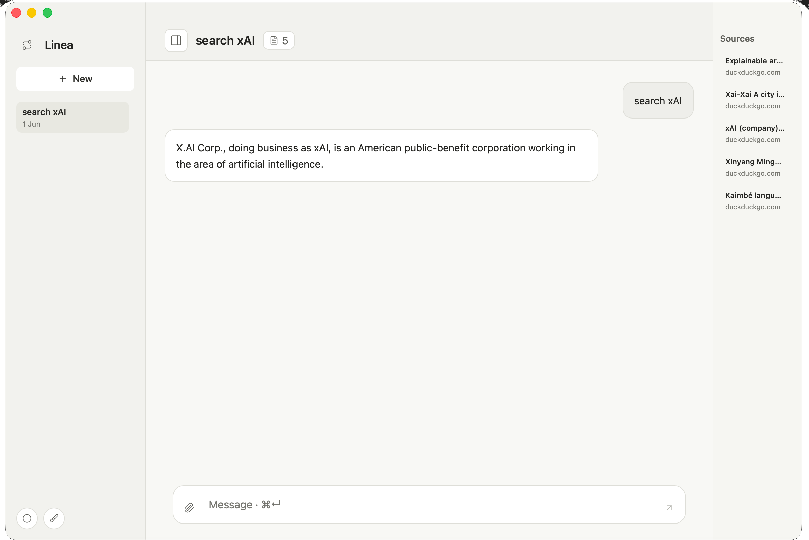

# macOS

This is the macOS package shape.

# Goal

Ship a local macOS app for Linea.

The app should:

* start Linea locally
* open a chat interface
* use the same API contract as the web UI
* keep PostgreSQL and provider config outside the app bundle
* package as a `.dmg`

# Desktop Shell

Use a thin desktop shell.

The shell wraps the existing web UI.

The Go backend stays the source of truth.

No native rewrite yet.



# App Shape

Process:

* macOS app starts the bundled `linea` server
* app waits for `/healthz`
* app opens the local UI
* app stops the child server on quit

Config:

* read `~/.config/linea/linea.env`
* never store provider keys in app code
* keep existing environment variable names

Data:

* use the same `DATABASE_URL`
* keep memory storage available when no database is set

# Package

Target:

```text
dist/macos/Linea.app
dist/macos/Linea.dmg
```

First package can be unsigned for local testing.

Signing and notarization come after the app starts reliably.

Build:

```sh
make macos-package
```

The app bundle includes the Linea server binary.

The launcher is a small Swift app. It starts the server, waits for `/healthz`, opens the local UI in a WebView window, and stops the server when the app quits.

The window remembers its size. The menus include reload, window controls, and normal quit behavior.

Open the DMG and drag `Linea.app` to `Applications`.

# Checks

Before a DMG:

```sh
make test
make release-check
```

Manual check:

* app opens
* server starts
* chat works
* web search works
* file attachment works
* image input works when Gemini quota allows it
* quit stops the local server

# Later

Do not build Android during this step.

Do not add accounts.

Do not add sync.

Do not rewrite the UI natively.

Do not move secrets into app storage.
